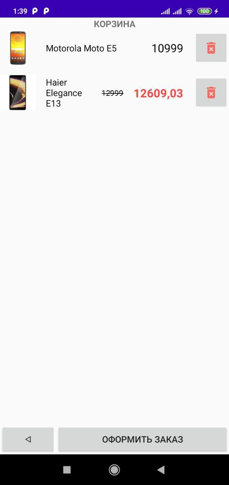
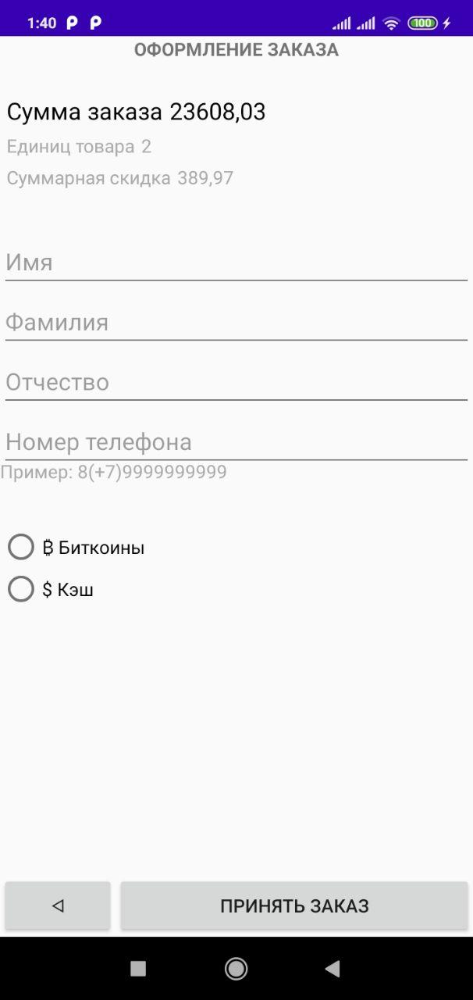

# Интернет-магазин

Android development курс от Napoleon IT

## Функциональность

* Экраны:
  * Каталог
  * Информация о продукте
  * Корзина
  * Оформление заказа
* Каталог
  * Отображение скидки
  * Кнопка добавления в корзину
  * Для отображения списка используется RecyclerView
* Информация о продукте
  * Название товара в заголовке изображение и описание
  * Кнопка возврата
* Корзина
  * Кнопка удаления товара
  * Кнопка перехода к оформлению заказа
* Оформление заказа
  * Контактные данные клиента
  * Выбор способа оплаты
  * Информация о собранной корзине
  * Валидация номера телефона
  * После принятия заказа возврат в чистую корзину
* Прочее:
  * На всех экранах, кроме первого, есть кнопка возврата назад
  * На каждом экране Заголовок с описанием
  * При реализации экранов использован Moxy
  * Для работы объектов с ресурсами используется DI

## Внешний вид запущенного приложения

<p float="left">
  
  
  
  
</p>

## Структура проекта

```bash
|-- App.kt
|   (Реализация хранилища)
|-- data
|   `-- SharedPreferencesBasketDao.kt
|   (Инверсия зависимостей)
|-- di
|   |-- AppComponent.kt
|   `-- modules
|       |-- MainApiModule.kt
|       `-- PreferencesModule.kt
|   (Сущности предметной области, логика работы с БД и сетью)
|-- domain
|   |-- BasketProductDao.kt
|   |-- MainApi.kt
|   |-- RemoteProduct.kt
|   `-- model
|       |-- Basket.kt
|       |-- Order.kt
|       |-- Payment.kt
|       `-- Product.kt
|   (Интерфейсы отображения данных модели и взамосвязь между моделью и ui)
|-- presenter
|   |-- BasePresenter.kt
|   |-- BasketPresenter.kt
|   |-- BasketView.kt
|   |-- CatalogPresenter.kt
|   |-- CatalogView.kt
|   |-- OrderPresenter.kt
|   |-- OrderView.kt
|   `-- ProductView.kt
|   (Внешний вид приложения, активные окна)
|-- ui
|   |-- BaseActivity.kt
|   |-- BasketActivity.kt
|   |-- BasketAdapter.kt
|   |-- CatalogActivity.kt
|   |-- CatalogAdapter.kt
|   |-- DialogFragment.kt
|   |-- OrderActivity.kt
|   `-- ProductInfoActivity.kt
|   (Вспомогательные утилиты)
`-- utils
    |-- AfterTextChangedWatcher.kt
    `-- untils.kt
```
